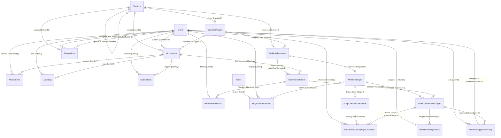

# Configurable Approval Workflow Database Schema Design Document

This document provides a comprehensive database schema specification and relationship design for the multi-tenant **Configurable Approval Workflow Engine** in DocuFlow.

---

## 1. Complete Entity Relationship Diagram (ERD)

The diagram below represents the logical relationships between the 19 entities of the configurable workflow system.

---

## 2. Master / Reference Tables

### 2.1 Divisions
Company divisions; self-referencing to support hierarchy (e.g. Division → Sub-division).

| Column | Type / Key | Description |
| :--- | :--- | :--- |
| `DivisionID` | INT, PK | Unique identifier |
| `Name` | VARCHAR(200) | Division name |
| `ParentDivisionID` | INT, FK → `Divisions` | Self-reference for hierarchy; `NULL` for top-level |
| `Code` | VARCHAR(20) | Short code, e.g. used in document numbering |
| `IsActive` | BIT | Soft-disable flag |

---

### 2.2 Users
All employees who can submit, approve, or be notified. RolesJSON holds one or more `{RoleID, DivisionID}` pairs, so a user can hold multiple roles — each possibly in a different division — without a separate bridge table.

| Column | Type / Key | Description |
| :--- | :--- | :--- |
| `UserID` | INT, PK | Unique identifier |
| `Name` | NVARCHAR(150) | Display name |
| `Email` | NVARCHAR(150) | Login / notification address |
| `RolesJSON` | NVARCHAR(MAX) | Array of `{RoleID, DivisionID}`, e.g. `[{"RoleID":2,"DivisionID":1},{"RoleID":5,"DivisionID":3}]` |
| `IsActive` | BIT | Soft-disable flag |

---

### 2.3 Roles
Lookup of role names referenced by RoleID inside `Users.RolesJSON` (e.g. Manager, VP, Finance Approver).

| Column | Type / Key | Description |
| :--- | :--- | :--- |
| `RoleID` | INT, PK | Unique identifier |
| `Name` | VARCHAR(100) | Role name |

---

### 2.4 DocumentTypes
Catalog of document types that can be routed through approval (Invoice, PO, Leave Request, Contract, etc.).

| Column | Type / Key | Description |
| :--- | :--- | :--- |
| `DocTypeID` | INT, PK | Unique identifier |
| `Name` | VARCHAR(150) | Document type name |
| `Code` | VARCHAR(30) | Short code |
| `DivisionID` | INT, FK → `Divisions`, `NULL` | `NULL` = usable by all divisions |
| `IsActive` | BIT | Soft-disable flag |

---

## 3. Workflow Configuration Tables (Design-Time)

### 3.1 WorkflowTemplates
The reusable definition of a workflow for a document type. Versioned so live documents are unaffected by later edits.

| Column | Type / Key | Description |
| :--- | :--- | :--- |
| `WorkflowTemplateID` | INT, PK | Unique identifier |
| `DocTypeID` | INT, FK → `DocumentTypes` | Applies to this document type |
| `DivisionID` | INT, FK → `Divisions`, `NULL` | `NULL` = applies to all divisions |
| `Version` | INT | Increments on each republish |
| `IsActive` | BIT | Only one active version should be used for new submissions |
| `EffectiveFrom` | DATE | Start of validity |
| `EffectiveTo` | DATE, `NULL` | End of validity, if retired |

---

### 3.2 WorkflowStages
Ordered stages within a template (e.g. Manager Review → Finance Review → Final Approval).

| Column | Type / Key | Description |
| :--- | :--- | :--- |
| `StageID` | INT, PK | Unique identifier |
| `WorkflowTemplateID` | INT, FK → `WorkflowTemplates` | Parent template |
| `SequenceOrder` | INT | Order of execution |
| `StageName` | VARCHAR(200) | Display name |
| `ApprovalType` | VARCHAR(20) | `SINGLE` / `ANY_ONE` / `ALL` / `QUORUM` |
| `QuorumValue` | INT, `NULL` | Count or % required when `ApprovalType = QUORUM` |
| `IsParallel` | BIT | Runs alongside other stages vs. strictly sequential |
| `SLAHours` | INT, `NULL` | Hours before escalation/reminder |
| `OnReject` | VARCHAR(20) | `TERMINATE` / `RETURN_PREV` / `RETURN_SUBMITTER` |

---
n
### 3.3 StageChecklistTemplates (Option A — recommended)
Design-time checklist items mapped to specific stages in a workflow. Each item is a separate row linked to a specific StageID (e.g. Stage ID 12 for "IA Approval"). Use this table instead of the ChecklistJSON column if checklist items need to be individually queryable, reportable, and auditable.

| Column | Type / Key | Description |
| :--- | :--- | :--- |
| `ChecklistItemID` | INT, PK (Identity) | Unique identifier |
| `StageID` | INT, FK → `WorkflowStages` | Links this item to a specific workflow stage |
| `ItemText` | VARCHAR(255) | The instructions/text of the checklist item |
| `SequenceOrder` | INT | Display order of the item within the stage's checklist |
| `IsRequired` | BIT | `1` (True) = item must be checked before the stage can be approved |
| `IsActive` | BIT | Soft-disable flag — retire an item without deleting its history |

---

### 3.4 StageApproverRules
Defines who can approve a given stage — the configurable core of the engine.

| Column | Type / Key | Description |
| :--- | :--- | :--- |
| `RuleID` | INT, PK | Unique identifier |
| `StageID` | INT, FK → `WorkflowStages` | Stage this rule applies to |
| `RuleType` | VARCHAR(30) | `SPECIFIC_USER` / `ROLE` / `SUBMITTER_MANAGER` / `DIVISION_HEAD` / `DYNAMIC` |
| `RoleID` | INT, FK → `Roles`, `NULL` | Used when `RuleType = ROLE` |
| `UserID` | INT, FK → `Users`, `NULL` | Used when `RuleType = SPECIFIC_USER` |
| `ConditionJSON` | NVARCHAR(MAX), `NULL` | e.g. `{"amount_gt": 50000}` for threshold-based routing |

---

## 4. Document & Execution Tables (Runtime)

### 4.1 Documents
Generic document header — one row per submitted document, of any type, from any division.

| Column | Type / Key | Description |
| :--- | :--- | :--- |
| `DocKey` | INT, PK (Identity) | Unique identifier |
| `DocTypeID` | INT, FK → `DocumentTypes` | Type of document |
| `DivisionID` | INT, FK → `Divisions` | Owning division |
| `CompanyCode` | VARCHAR(200) | ERP company code |
| `DocNum` | INT | Document number (per series) |
| `DocDate` | DATE | Document date |
| `CardCode` | VARCHAR(50) | Business partner code |
| `CardName` | NVARCHAR(250) | Business partner name |
| `DocTotal` | NUMERIC(18,2), `NULL` | Document value |
| `Status` | VARCHAR(20) | `DRAFT` / `IN_PROGRESS` / `APPROVED` / `REJECTED` / `CANCELLED` |
| `AttributesJSON` | NVARCHAR(MAX), `NULL` | Type-specific fields (e.g. GSTIN, BankAccount, Shade, etc.) |
| `SubmittedBy` | INT, FK → `Users` | Submitter |
| `CreatedDate` | DATETIME | Submission timestamp |
| `IsCancelled` | BIT | Cancellation flag |
| `CancelledBy` | INT, FK → `Users`, `NULL` | Who cancelled |
| `CancelledReason` | NVARCHAR(MAX), `NULL` | Reason for cancellation |

---

### 4.2 WorkflowInstances
One running workflow tied to exactly one document.

| Column | Type / Key | Description |
| :--- | :--- | :--- |
| `InstanceID` | INT, PK | Unique identifier |
| `DocKey` | INT, FK → `Documents` | Document this instance belongs to |
| `WorkflowTemplateID` | INT, FK → `WorkflowTemplates` | Template used |
| `TemplateVersion` | INT | Version pinned at start — insulates in-flight docs from later template edits |
| `Status` | VARCHAR(20) | `IN_PROGRESS` / `APPROVED` / `REJECTED` / `CANCELLED` |
| `StartedDate` | DATETIME | When the workflow began |
| `CompletedDate` | DATETIME, `NULL` | When it finished |

---

### 4.3 WorkflowInstanceStages
Tracks the live status of each stage as it executes for a specific document.

| Column | Type / Key | Description |
| :--- | :--- | :--- |
| `InstanceStageID` | INT, PK | Unique identifier |
| `InstanceID` | INT, FK → `WorkflowInstances` | Parent instance |
| `StageID` | INT, FK → `WorkflowStages` | Stage definition being executed |
| `Status` | VARCHAR(20) | `PENDING` / `ACTIVE` / `APPROVED` / `REJECTED` / `SKIPPED` |
| `StartedDate` | DATETIME, `NULL` | When the stage became active |
| `DueDate` | DATETIME, `NULL` | SLA deadline |
| `CompletedDate` | DATETIME, `NULL` | When the stage finished |

---

### 4.4 WorkflowAssignments
Who currently owns a stage — replaces free-text/CSV user-ID lists with a proper relational link.

| Column | Type / Key | Description |
| :--- | :--- | :--- |
| `AssignmentID` | INT, PK | Unique identifier |
| `InstanceStageID` | INT, FK → `WorkflowInstanceStages` | Stage being assigned |
| `UserID` | INT, FK → `Users` | Assigned approver |
| `AssignedDate` | DATETIME | When assigned |
| `IsCurrent` | BIT | `TRUE` while still pending this user's action |

---

### 4.5 WorkflowApprovalHistory
Immutable log of every approval action taken — the audit trail.

| Column | Type / Key | Description |
| :--- | :--- | :--- |
| `HistoryID` | INT, PK | Unique identifier |
| `InstanceStageID` | INT, FK → `WorkflowInstanceStages` | Stage the action was taken on |
| `UserID` | INT, FK → `Users` | Who acted |
| `Action` | VARCHAR(20) | `APPROVED` / `REJECTED` / `DELEGATED` / `RECALLED` |
| `Comment` | NVARCHAR(MAX), `NULL` | Approver remarks |
| `ActedDate` | DATETIME | Timestamp of the action |
| `DelegatedToUserID` | INT, FK → `Users`, `NULL` | Set when `Action = DELEGATED` |

---

### 4.6 WorkflowInstanceStageChecklists (Option A — recommended)
Runtime execution audit log. When the approver checks the boxes on a stage and clicks Approve, the backend records the completion of each checklist item as a row here. Pairs with `StageChecklistTemplates` (3.3).

| Column | Type / Key | Description |
| :--- | :--- | :--- |
| `InstanceChecklistID` | INT, PK (Identity) | Unique identifier |
| `InstanceStageID` | INT, FK → `WorkflowInstanceStages` | Identifies the active stage this checklist was submitted for |
| `ChecklistItemID` | INT, FK → `StageChecklistTemplates` | Links to the specific checklist question being checked |
| `IsChecked` | BIT | `1` (True) = verified; `0` (False) = unchecked |
| `CheckedBy` | INT, FK → `Users` | The user who checked off the item |
| `CheckedDate` | DATETIME | Timestamp of when it was checked |
| `Remarks` | NVARCHAR(MAX), `NULL` | Optional free-text note attached to this specific check, e.g. "Attached scanned receipt copy" |

---

### 4.7 WorkflowFollowers
Users who receive visibility/notifications on an instance without being approvers.

| Column | Type / Key | Description |
| :--- | :--- | :--- |
| `FollowerID` | INT, PK | Unique identifier |
| `InstanceID` | INT, FK → `WorkflowInstances` | Instance being followed |
| `UserID` | INT, FK → `Users` | Follower |

---

## 5. Supporting Tables

### 5.1 Delegations
Out-of-office / temporary approval delegation from one user to another.

| Column | Type / Key | Description |
| :--- | :--- | :--- |
| `DelegationID` | INT, PK | Unique identifier |
| `FromUserID` | INT, FK → `Users` | Delegating user |
| `ToUserID` | INT, FK → `Users` | Delegate |
| `DivisionID` | INT, FK → `Divisions`, `NULL` | Scope; `NULL` = all divisions |
| `StartDate` | DATE | Delegation start |
| `EndDate` | DATE | Delegation end |

---

### 5.2 Attachments
Files attached to a document.

| Column | Type / Key | Description |
| :--- | :--- | :--- |
| `AttachmentID` | INT, PK | Unique identifier |
| `DocKey` | INT, FK → `Documents` | Parent document |
| `FileName` | NVARCHAR(255) | Original file name |
| `FilePath` | NVARCHAR(500) | Storage location |
| `UploadedBy` | INT, FK → `Users` | Uploader |
| `UploadedDate` | DATETIME | Upload timestamp |

---

### 5.3 AuditLog
General-purpose audit trail beyond approval actions (edits, views, status changes).

| Column | Type / Key | Description |
| :--- | :--- | :--- |
| `LogID` | INT, PK | Unique identifier |
| `DocKey` | INT, FK → `Documents` | Related document |
| `ActorID` | INT, FK → `Users` | Who performed the action |
| `Action` | VARCHAR(50) | Action description |
| `DetailsJSON` | NVARCHAR(MAX), `NULL` | Structured details |
| `CreatedDate` | DATETIME | Timestamp |

---

### 5.4 Notifications
Alerts and reminders sent to users.

| Column | Type / Key | Description |
| :--- | :--- | :--- |
| `NotificationID` | INT, PK | Unique identifier |
| `UserID` | INT, FK → `Users` | Recipient |
| `DocKey` | INT, FK → `Documents` | Related document |
| `Type` | VARCHAR(50) | e.g. `ASSIGNED`, `SLA_BREACH`, `APPROVED` |
| `SentDate` | DATETIME | When sent |
| `ReadDate` | DATETIME, `NULL` | When read, if read |
