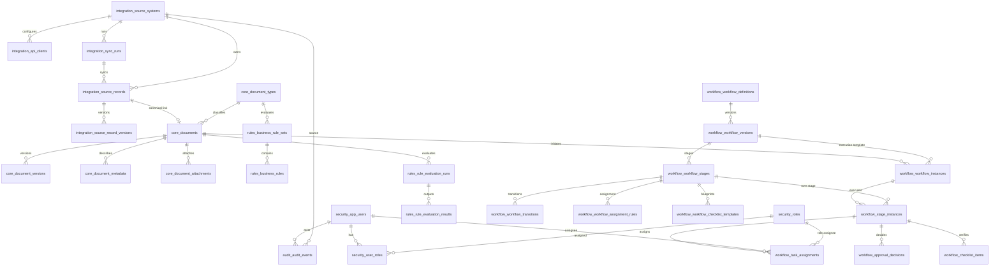

# DocuFlowDB Relationships & Cardinality Guide

This document describes the relationship rules, schema ownership, and cardinality details for the tables in DocuFlowDB.

---

## 🏛️ Schema Structure & Boundaries

DocuFlowDB uses logical schemas to separate actors, ingestion state, document models, business routing, workflow templates, execution state, and immutable event records.

---

## 🔗 Schema Cardinality Details

### 1. Security Schema
- **`security.app_users` to `security.user_roles`**: `1 : N` (One user can have multiple role mappings).
- **`security.roles` to `security.user_roles`**: `1 : N` (One role can be mapped to multiple users).
- Combined: `security.app_users` and `security.roles` form an `M : N` (many-to-many) relationship via the bridge table `security.user_roles`.

### 2. Integration Schema
- **`integration.source_systems` to `integration.api_clients`**: `1 : N` (One source system can register multiple API clients/credentials).
- **`integration.source_systems` to `integration.sync_runs`**: `1 : N` (One system triggers multiple batch sync executions).
- **`integration.sync_runs` to `integration.source_records`**: `1 : N` (One sync batch contains multiple source records).
- **`integration.source_records` to `integration.source_record_versions`**: `1 : N` (One sync record retains historical versions of its payload values).
- **`integration.source_records` to `core.documents`**: `1 : 0..1` (A synced record optionally resolves into exactly one canonical document, or remains unmapped/invalid).

### 3. Canonical Document Schema
- **`core.document_types` to `core.documents`**: `1 : N` (One doc type like AP_INVOICE classifies multiple documents).
- **`core.documents` to `core.document_versions`**: `1 : N` (One canonical document retains multiple immutable snapshots).
- **`core.documents` to `core.document_metadata`**: `1 : N` (One document has multiple searchable key-value parameters).
- **`core.documents` to `core.document_attachments`**: `1 : N` (One document has multiple physical files or PDFs attached).

### 4. Business Rules Schema
- **`rules.business_rule_sets` to `rules.business_rules`**: `1 : N` (One active rule set evaluates multiple rules).
- **`core.documents` to `rules.rule_evaluation_runs`**: `1 : N` (A document's workflow initiation evaluates rules multiple times during lifecycle sync).
- **`rules.rule_evaluation_runs` to `rules.rule_evaluation_results`**: `1 : N` (One run records individual pass/fail results for each rule).

### 5. Workflow Design Schema
- **`workflow.workflow_definitions` to `workflow.workflow_versions`**: `1 : N` (One workflow defines multiple versions over time).
- **`workflow.workflow_versions` to `workflow.workflow_stages`**: `1 : N` (One workflow template has multiple stages).
- **`workflow.workflow_stages` to `workflow.workflow_transitions`**: `1 : N` (One stage defines multiple routing targets).
- **`workflow.workflow_stages` to `workflow.workflow_assignment_rules`**: `1 : N` (One stage maps rules for assignee selection).
- **`workflow.workflow_stages` to `workflow.workflow_checklist_templates`**: `1 : N` (One stage maps checklist requirements).

### 6. Workflow Runtime Schema
- **`core.documents` to `workflow.workflow_instances`**: `1 : N` (Usually `1 : 1` for active workflows, but a document can be re-routed through a new instance if reset).
- **`workflow.workflow_versions` to `workflow.workflow_instances`**: `1 : N` (One published template version runs multiple documents).
- **`workflow.workflow_instances` to `workflow.stage_instances`**: `1 : N` (One running workflow progresses through multiple active/completed stage logs).
- **`workflow.stage_instances` to `workflow.task_assignments`**: `1 : N` (A running stage assigns review tasks to individual users or pools).
- **`workflow.stage_instances` to `workflow.checklist_items`**: `1 : N` (A running stage initializes checklist points to verify).
- **`workflow.stage_instances` to `workflow.approval_decisions`**: `1 : N` (A running stage records approval/rejection signatures).

### 7. Audit Schema
- **`audit.audit_events`**: Relates loosely via `actor_user_id` (`security.app_users.user_id`), `source_system_id` (`integration.source_systems.source_system_id`), and table keys. It is built as a flat, indexed log with no cascade deletes to preserve full operational history.
